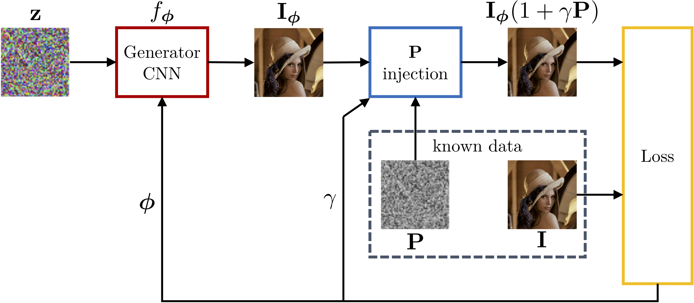

# DIPPAS: A Deep Image Prior PRNU Anonymization Scheme



This is the official repository of **DIPPAS: A Deep Image Prior PRNU Anonymization Scheme**,
submitted to IEEE Transactions on Information Forensics and Security and currently available on [arXiv](https://arxiv.org/pdf/2012.03581.pdf).

## Code

### Prerequisites

- Install conda
- Create the `dippas` environment with `environment.yml`
```bash
$ conda env create -f environment.yml
$ conda activate dippas
```
- The code has been tested on Nvidia Tesla P80 and V100 GPUs.


### Dataset preparation

We provide this repo with an example dataset based on Dresden Image Database.
The folder structure has to be preserved:

```
dataset_name
    device_1
        picture_1
        picture_2
        ...
        prnu.npy
    device_2
        ...
    ...    
```

### Anonymization scheme

The proposed anonymization scheme relies on three steps:

1. `main_1_dip.py` is responsible for the deep prior inversion. 
    For each image, it constructs the inverse problem and solve it iteratively.
    The output images obtained at the different iterations are stored in a hdf5 file, along with a npy file containing the inversion hyperparameters and history.
    The user has a number of options; check out the parameters with `python main_1_dip.py --help`

    Basic example on the provided dataset, using the PRNU-aware strategy and skipping the NCC computation (that will be performed in the next step):
    ```bash
    $ python main_1_dip.py --epochs 2000 --prnu aware --ncc skip --outpath my_run_folder
    ```

2. After the inversion is done, `main_2_blocks.npy` computes the NCC with the device PRNU over squared blocks extracted from each output image produced at step  1.
    
    To compute the NCC over blocks of 64x64 samples from the previous results, simply do:
    ```bash
    $ python main_2_blocks.py --run my_run_folder/IMG_NAME --block_size 64
    ```

3. `main_3_final.npy` generates the final anonymized image.
    For each block position, we take a number of blocks extracted from different iterations outputs, with a constraint on the PSNR.
    These blocks are averaged together, and the final image is then assembled from the blocks. 
    
    ```bash
    $ python main_3_final.py --run my_run_folder/IMG_NAME --block_size 64 --num_blocks 50 --psnr_thresh 37.
    ```

## Credits
[ISPL: Image and Sound Processing Lab - Politecnico di Milano](http://ispl.deib.polimi.it/)
- Francesco Picetti (francesco.picetti@polimi.it)
- Sara Mandelli (sara.mandelli@polimi.it)
- Paolo Bestagini (paolo.bestagini@polimi.it) 
- Vincenzo Lipari (vincenzo.lipari@polimi.it)
